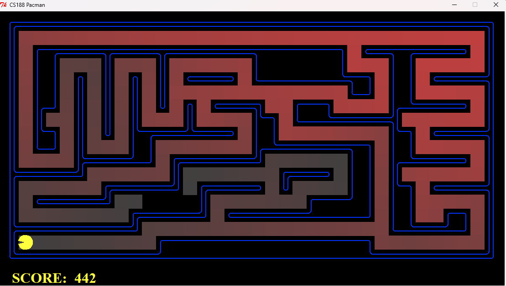
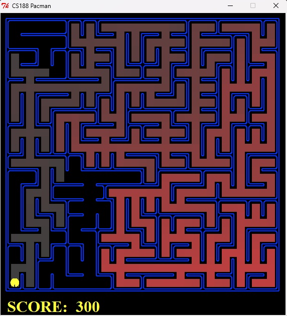

# Search Algorithms

A comprehensive collection of classic and advanced search, game-tree,
and heuristic algorithms implemented in Python --- combining
AIMA-inspired implementations with the Berkeley CS188 Pac-Man search
project.

------------------------------------------------------------------------

## Repository Structure

    search-algorithms/
    │
    ├── aima-search/        # AIMA-inspired search, game-tree, CSP, and tree data structures
    └── pacman-search/      # Berkeley CS188 Pac-Man search project (DFS, BFS, UCS, A*)

This repository merges two complementary projects:

-   **AIMA-Inspired Search Algorithms Collection**
-   **Berkeley CS188 -- Pac-Man Search Project**

Together, they provide both theoretical and applied perspectives on
search algorithms in Artificial Intelligence.

------------------------------------------------------------------------

# 1. AIMA Search (aima-search/)

## AIMA‑Inspired Search Algorithms Collection

Some **search and game‑tree algorithms** implemented in Python, adapted from (and fully compatible with) the **[AIMA‑Python](https://github.com/aimacode/aima‑python) framework**.  
The repository is meant as a learning sandbox and reference for AI coursework, coding interviews, and hobby projects.

---

## Algorithms and Problems

| Category                          | Algorithms / Problems                                                                                                                                                                                           |
| --------------------------------- | --------------------------------------------------------------------------------------------------------------------------------------------------------------------------------------------------------------- |
| **Uninformed / Heuristic Search** | • **A\*** (graph + tree versions)<br>• **Alpha Beta Pruning**<br>• **Greedy Best‑First Search**<br>• **Hill‑Climbing** (steepest‑ascent & stochastic variants)                                                  |
| **Constraint & Logic Puzzles**    | • **Zebra Puzzle (“Einstein’s Riddle”)** CSP solver                                                                                                                                                             |
| **Classical Planning Problems**   | • **Missionaries & Cannibals** state‑space search                                                                                                                                                               |
| **Game‑Tree Algorithms**          | • **Minimax** (deterministic, two‑player)<br>• **Alpha‑Beta Pruning**<br>• **Chance Games** <br>• **Chance Nodes** (**Expectiminimax**)<br>• **Multi‑Agent Chance Games**<br>• **Multi‑Agent Stochastic Trees** |
| **Data Structures**               | • **B‑Tree** (search / insertion)<br>• **B+‑Tree** (search / insertion / range scan)                                                                                                                            |

Every module is **self‑contained**: importable as a library or runnable as a script with demo problems.

---

## Quick Start

```bash
# 1. Clone and enter
git clone https://github.com/jerinmulangan/aima-search.git
cd aima-search

# 2. (Recommended) create a virtual env
python -m venv .venv && source .venv/bin/activate   
# Windows: .venv\Scripts\activate

# Optionally run on Conda
conda create -n myenv python=3.13

```

### Running Examples

```bash
# Missionaries & Cannibals with A* (Manhattan distance heuristic)
python missionaries_cannibals.py --algo astar

# Zebra puzzle CSP – prints house assignments
python zebra.py

# Alpha‑Beta demo standard tree
python alpha_beta_prune.py

# A* Algorithm demo on flight paths
python astar_flight.py

# Insert & search demo in a B+‑Tree of order 4
python b+_tree.py

```

### Layout

```
aima-search/
│
├─ algorithms/          
│   ├─ astar_flight.py            # A* Algorithm on Flight Path Tree
│   ├─ astar_flight_test.py       # A* Algorithm Testing
│   ├─ gbfs_astar.py              # Greedy Best-First Search Algorithm
│   └─ hill_climbing.py           # Hill Climbing Algorithm
│
├─ games/
│   ├─ minimax.py                 # Minimax Tree and Algorith
│   ├─ alpha_beta_prune.py        # Alpha Beta Pruning on Standard Tree
│   ├─ chance_game.py             # Chance Game on Standard Tree
│   ├─ chance_game_tree.ipynb     # Game Tree for Chance
│   ├─ expectimax_chance.py       # Expectimax Game with Chance
│   ├─ game_tree_jupyter.ipynb    # Game Tree for Expectimax
│   └─ multiagent_chance.py       # Multi-Agent Chance Game
│
├─ puzzles/
│   ├─ missionaries_cannibals.py  # Missionaries and Cannibals State Space
│   └─ zebra_search.py            # Zebra Search CSP
│
├─ datastructures/
│   ├─ b_tree_234.py              # 2-3-4 B-Tree
│   ├─ b_tree_presplit.py         # B-Tree with Preemptive Split
│   └─ b+_tree.py                 # B+ Tree
│
└─ README.md 

```

------------------------------------------------------------------------

# 2. Pac-Man Search (pacman-search/)

This project is for CS 4365 Artificial Intelligence Course

Project Link: [http://ai.berkeley.edu/project_overview.html](http://ai.berkeley.edu/project_overview.html)
###### **Requires Python 2.7**
## Berkeley CS 188 ‑ Project 1: **Pac‑Man Search**  

Solutions to the first Berkeley AI project: building general‑purpose search algorithms and applying them to guide Pac‑Man through a variety of maze challenges.  
*(All extra‑credit / bonus portions were **not** implemented.)*

---

## Table of Contents
1. [Project Overview](#project-overview)  
2. [Implemented Questions](#implemented-questions)  
3. [Installation & Setup](#installation--setup)  
4. [Running Pac‑Man](#running-pac-man)  
5. [Autograder](#autograder)  
6. [Sample Commands](#sample-commands)  
7. [Notes & Assumptions](#notes--assumptions)  
8. [License](#license)  

---

## Project Overview
The goal of Project 1 is to **design generic search algorithms**—Depth‑First Search, Breadth‑First Search, Uniform‑Cost Search, and A\*—then apply them to Pac‑Man scenarios such as:

* Navigating to a fixed location  
* Visiting all four corners of a maze  
* Collecting all food dots in the fewest steps  
* Quickly grabbing the *nearest* dot (sub‑optimal greedy strategy)

The project is entirely self‑contained and uses the CS 188 Pac‑Man code base supplied by UC Berkeley. Only two files require modification:

| File | Purpose |
|------|---------|
| `search.py` | Generic uninformed & informed search algorithms |
| `searchAgents.py` | Problem definitions, heuristics, and agents |

All other files serve as the game engine, display code, data structures, or the autograder.

---

## Implemented Questions
| Q # | Description | Key Work Completed |
|-----|-------------|--------------------|
| **1** | *Depth‑First Search* | Implemented **graph‑based DFS** in `depthFirstSearch()` |
| **2** | *Breadth‑First Search* | Implemented **graph‑based BFS** in `breadthFirstSearch()` |
| **3** | *Uniform‑Cost Search* | Implemented UCS in `uniformCostSearch()`; added cost functions for “Stay‑East” / “Stay‑West” agents |
| **4** | *A\* Search* | Implemented A\* in `aStarSearch()` and verified with `manhattanHeuristic` |
| **5** | *Corners Problem* | Defined `CornersProblem` state space & successor function |
| **6** | *Corners Heuristic* | Wrote **consistent, admissible** heuristic `cornersHeuristic()` |
| **7** | *Food Search* | Implemented `foodHeuristic()` for `FoodSearchProblem` (consistent, non‑trivial) |
| **8** | *Closest‑Dot Search* | Completed `findPathToClosestDot()` and goal test for `AnyFoodSearchProblem` |

> **Performance:** All autograder tests pass within the required node‑expansion limits; no bonus tasks attempted.

---

## Installation & Setup

**Clone repository**

```
   git clone https://github.com/jerinmulangan/pacman‑search.git
   cd pacman‑search
```

**Install Dependencies**

```bash
pip install pygame   # optional
```

## Running Pac‑Man

Launch a default game:

```bash
python pacman.py

# Show all available flags
python pacman.py -h
```

## Autograder

Check all questions:

```bash
python autograder.py

# Single test
python autograder.py -q q4
```

The autograder outputs **PASS/FAIL** along with node‑expansion statistics. The inal score equals the autograder total.

## Sample Commands

| Task                  | Command                                                                                     |
| --------------------- | ------------------------------------------------------------------------------------------- |
| DFS on `mediumMaze`   | `python pacman.py -l mediumMaze -p SearchAgent -a fn=dfs`                                   |
| BFS on `bigMaze`      | `python pacman.py -l bigMaze -p SearchAgent -a fn=bfs -z .5`                                |
| UCS with default cost | `python pacman.py -l mediumMaze -p SearchAgent -a fn=ucs`                                   |
| Stay‑East UCS         | `python pacman.py -l mediumDottedMaze -p StayEastSearchAgent`                               |
| A* (Manhattan)        | `python pacman.py -l bigMaze -p SearchAgent -a fn=astar,heuristic=manhattanHeuristic -z .5` |
| A* Corners            | `python pacman.py -l mediumCorners -p AStarCornersAgent -z .5`                              |
| A* Food Search        | `python pacman.py -l trickySearch -p AStarFoodSearchAgent`                                  |
| Greedy Closest‑Dot    | `python pacman.py -l bigSearch -p ClosestDotSearchAgent -z .5`                              |

*Use `--frameTime 0` to speed up visualizations.*

#### Examples

**UCS with default cost**

```
pacman> python pacman.py -l mediumMaze -p SearchAgent -a fn=ucs
[SearchAgent] using function ucs
[SearchAgent] using problem type PositionSearchProblem
Path found with total cost of 68 in 0.0 seconds
Search nodes expanded: 269
Pacman emerges victorious! Score: 442
Average Score: 442.0
Scores:        442.0
Win Rate:      1/1 (1.00)
Record:        Win
```




**A-Star Manhattan**

```
pacman> python pacman.py -l bigMaze -p SearchAgent -a fn=astar,heuristic=manhattanHeuristic -z .5
[SearchAgent] using function astar and heuristic manhattanHeuristic
[SearchAgent] using problem type PositionSearchProblem
Path found with total cost of 210 in 0.0 seconds
Search nodes expanded: 549
Pacman emerges victorious! Score: 300
Average Score: 300.0
Scores:        300.0
Win Rate:      1/1 (1.00)
Record:        Win
```


## Notes & Assumptions

- **Graph Search** (closed‑set) versions were used throughout to prevent state re‑expansion.
- All heuristics are **admissible & consistent**; empirical checks verified `f`–value monotonicity.
- The project targets **Python 2.7**; earlier and later versions are untested.

------------------------------------------------------------------------

# Key Learning Outcomes

-   Graph vs Tree search
-   Closed-set implementations
-   Heuristic admissibility & consistency
-   State-space modeling
-   Multi-agent stochastic trees
-   Practical search performance tradeoffs
-   Integration of search with real-time game environments

------------------------------------------------------------------------

# License

MIT License

Berkeley Pac-Man framework © University of California, Berkeley.
